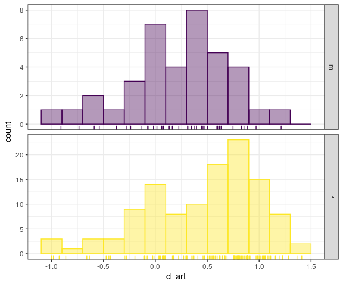
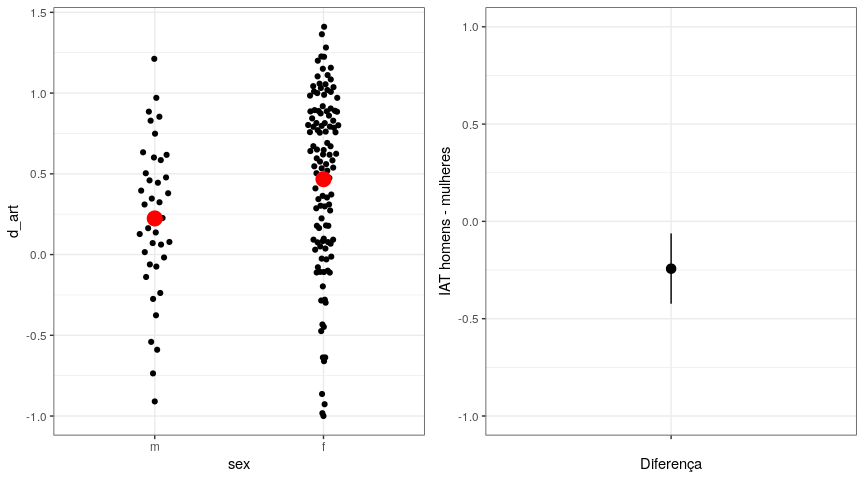

Sobre IAT
=========

IAT: 0.15, 0.35, and 0.65 are considered small, medium, and large level
of bias for individual scores.

Positive means bias towards arts / against Math.

Análise de uma replicação
=========================



<!-- # ```{r} -->
<!-- # iat %>%  -->
<!-- #     ggplot(aes(x = sex, y = d_art)) +  -->
<!-- #     geom_quasirandom(width = .1) -->
<!-- # ``` -->
<!-- ```{r} -->
<!-- iat %>%  -->
<!--     ggplot(aes(x = sex, y = d_art)) +  -->
<!--     geom_quasirandom(width = .1) +  -->
<!--     stat_summary(geom = "point", fun.y = "mean", color = "red", size = 5) -->
<!-- ``` -->
##### Qual a diferença na amostra

    ## [1] 155

    ## # A tibble: 2 x 4
    ##   sex   media    sd     n
    ##   <ord> <dbl> <dbl> <int>
    ## 1 m     0.224 0.485    38
    ## 2 f     0.467 0.548   117

    ## [1] -0.2430539

#### Comparação via ICs

    ## Rows: 1
    ## Columns: 5
    ## $ statistic <dbl> -0.2430539
    ## $ bias      <dbl> 0.0007663837
    ## $ std.error <dbl> 0.09024263
    ## $ conf.low  <dbl> -0.423045
    ## $ conf.high <dbl> -0.06162377

<!-- ```{r} -->
<!-- ci %>% -->
<!--     ggplot(aes( -->
<!--         x = "", -->
<!--         y = statistic, -->
<!--         ymin = conf.low, -->
<!--         ymax = conf.high -->
<!--     )) + -->
<!--     geom_pointrange() + -->
<!--     geom_point(size = 3) +  -->
<!--     labs(x = "Diferença",  -->
<!--          y = "IAT homens - mulheres") -->
<!-- ``` -->
    ## Warning: `fun.y` is deprecated. Use `fun` instead.



### Conclusão

Em média, as mulheres que participaram do experimento tiveram uma
associação implícita (medida pelo IAT) com a matemárica
**positiva/negativa** e **fraca/média/forte** (média XXX, desv. padrão
YYY, N = ZZZ). Homens tiveram uma associação **positiva/negativa** com a
matemática, portanto **maior/menor** que a das mulheres (média , desv.
padrão, N = ). Houve portanto uma **grande/considerável/pequena**
diferença entre homens e mulheres (diferença das médias XXXX, 95% CI
\[CCC, DDD\]). A partir desta amostra, estimamos que…

------------------------------------------------------------------------

*Exemplos de possíveis conclusões para completar*

-   mulheres têm uma associação negativa consideravelmente mais forte,
    com uma diferença que provavelmente está entre 0.6 e 1.0 ponto na
    escala IAT, o suficiente para diferenciar uma associação neutra de
    uma muito forte contra a matemática.
-   mulheres têm uma associação negativa mais forte, porém não é claro
    se essa diferença é grande, moderada ou pequena. É necessário
    coletar mais dados para determinar se a diferença é relevante ou
    negligenciável.
-   mulheres podem ter um associação negativa forte, pode não haver
    diferença entre sexos ou homens podem ter atitudes negativas um
    pouco mais fortes ou moderadamente mais fortes.
-   pode não haver uma diferença entre sexos, ou se ela existir, ela
    provavelmente é pequena em qualquer das direções.
